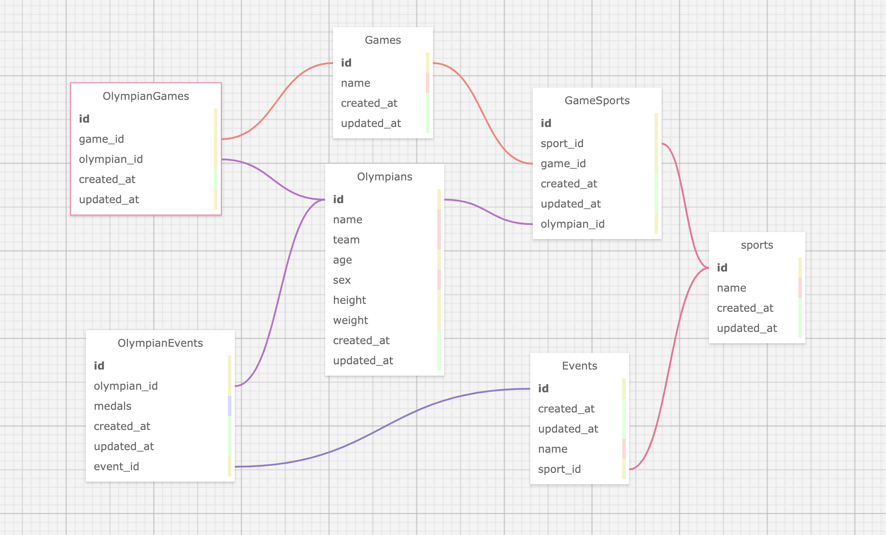

# Koroibos Olympics
This application allows users to get information about the olympics and statistics. All responses are JSON.

The app is deployed at https://koroibos-olympics.herokuapp.com/.

This project was part of [Turing School of Software & Design](https://turing.io)'s Back End Engineering program (Mod 4). See the project spec [here](https://github.com/turingschool/backend-curriculum-site/blob/gh-pages/module4/projects/take_home_challenge/prompts/olympic_spec.md). It was completed in 48 hours days by [Ryan Miller](https://github.com/ryanmillergm).

View the project board at https://github.com/ryanmillergm/koroibos_olympics/projects/1.

## Schema


## Tech Stack
 - Framework: Ruby on Rails v5.2.3
 - Language: Ruby
 - Database: PostgreSQL v7.12.1
 - ActiveRecord
 - Testing: RSpec

## Other Packages
 - None

## Local Setup
 - `$ git clone https://gitlab.com/ryanmillergm/koroibos_olympics.git`
 - `$ cd koroibos_olympics`
 - `$ bundle exec install`
 - `$ bundle exec rails db:create`
 - `$ bundle exec rails db:migrate`
 - `$ bundle exec rails db:seed`

## Data Importing
  `rake import:olympians`

## Running the Server Locally
 - `$ rails s`
 - Access endpoints at `http://localhost:3000`

## Running the Test Suite
 - `$ rspec`

## API Endpoints
### List all olympians in the database
Request:
```
GET api/v1/olympians
Accept: application/json
```
Example response:
```
Status: 200
Content-Type: application/json
Body:
{
  "olympians":
    [
      {
        "name": "Maha Abdalsalam",
        "team": "Egypt",
        "age": 18,
        "sport": "Diving"
        "total_medals_won": 0
      },
      {
        "name": "Ahmad Abughaush",
        "team": "Jordan",
        "age": 20,
        "sport": "Taekwondo"
        "total_medals_won": 1
      },
      {...}
    ]
}
```
### List the youngest olympian in the database
Request:
```
GET api/v1/olympians?age=youngest
Accept: application/json
```
Example response:
```
Status: 200
Content-Type: application/json
Body:
{
  [
    {
      "name": "Ana Iulia Dascl",
      "team": "Romania",
      "age": 13,
      "sport": "Swimming"
      "total_medals_won": 0
    }
  ]
}
```
### List the oldest olympian in the database
Request:
```
GET api/v1/olympians?age=oldest
Accept: application/json
```
Example response:
```
Status: 200
Content-Type: application/json
Body:
{
  [
    {
      "name": "Julie Brougham",
      "team": "New Zealand",
      "age": 62,
      "sport": "Equestrianism"
      "total_medals_won": 0
    }
  ]
}
```
### List general olympian statistics
Request:
```
GET api/v1/olympian_stats
Accept: application/json
```
Example response:
```
  {
    "olympian_stats": {
      "total_competing_olympians": 3120
      "average_weight:" {
        "unit": "kg",
        "male_olympians": 75.4,
        "female_olympians": 70.2
      }
      "average_age:" 26.2
    }
  }
```
### List olympic events statistics
Request:
```
GET api/v1/events
Accept: application/json
```
Example response:
```
{
  "events":
    [
      {
        "sport": "Archery",
        "events": [
          "Archery Men's Individual",
          "Archery Men's Team",
          "Archery Women's Individual",
          "Archery Women's Team"
        ]
      },
      {
        "sport": "Badminton",
        "events": [
          "Badminton Men's Doubles",
          "Badminton Men's Singles",
          "Badminton Women's Doubles",
          "Badminton Women's Singles",
          "Badminton Mixed Doubles"
        ]
      },
      {...}
    ]
}
```
### List olympic medalists for a specific event
Request:
GET api/v1/events/:id/medalists
Accept: application/json
```
Example response:
```
//Response Format
{
  "event": "Badminton Mixed Doubles",
  "medalists": [
      {
        "name": "Tontowi Ahmad",
        "team": "Indonesia-1",
        "age": 29,
        "medal": "Gold"
      },
      {
        "name": "Chan Peng Soon",
        "team": "Malaysia",
        "age": 28,
        "medal": "Silver"
      }
    ]
}
```

## Core Contributors
 - Ryan Miller, [@ryanmillergm](https://github.com/ryanmillergm)

### How to Contribute
 - Fork and clone the [repo](https://github.com/ryanmillergm/koroibos_olympics)
 - Make changes on your fork & push them to GitHub
 - Visit https://github.com/ryanmillergm/koroibos_olympics/pulls and click `New pull request`

## Known Issues
 - None
